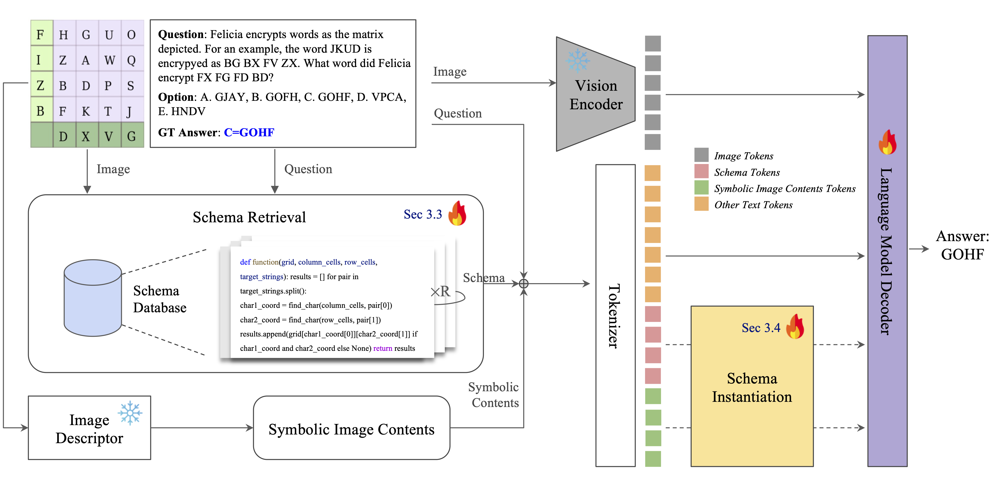

# Multimodal Schema Generation for Visual Chain-of-thought
Official Pytorch Implementation of the framework proposed in our paper **"Multimodal Schema Generation for Visual Chain-of-thought"**

## Overview
The rapid advancement of Vision-Language models (VLMs)
has enabled the achievement of human-level performance
across a wide range of tasks. However, the models still
demonstrate low performance in multimodal algorithmic
reasoning tasks, which need a deep understanding of visual
information and multi-step reasoning procedures. In this
paper, we introduce a novel approach that uses code-style
rationales to solve the complex visual-linguistic puzzle. The
core ideas of our methodology are twofold. First, we utilize
the multimodal perception capabilities of pretrained VLMs
to effectively generate code-style rationales from given im-
age and text information. By introducing code-style ratio-
nale, the model can make use of an organized foundation
for multi-step reasoning. Second, we propose a novel struc-
ture that can effectively merge visual information with the
code-style rationale. By achieving state-of-the-art perfor-
mance on challenging datasets that require complex rea-
soning abilities: SMART-101 and Geometry3K, we demon-
strated the effectiveness of our algorithm.

## Architecture


## Environment Setup
```bash
docker run -it --gpus '"device=0,1..."' --ipc=host --name {container_name} -v {data_path}/SMART101/:/data -v {home_path}:/SMART101 
git clone git@github.com:J-PARK11/Multimodal-Schema-Generation-for-Visual-Chain-of-thought.git
pip install -r requirements.txt
```

## Quick Start
### Schema based Multimodal Reasoning
```bash
# Train
CUDA_VISIBLE_DEVICES=0,1,2 python train.py --model_name Qwen2_VL_2B --epochs 5 --batch_size 4 --lr 1e-5 --experiment supervised --answer_type value --save_folder value_gen_with_opt_mca --use_gpu 0,1,2 --use_img True --use_option_prompt True 

# Eval
CUDA_VISIBLE_DEVICES=3,4,5 python eval.py --model_name Qwen2_VL_2B --batch_size 4 --experiment supervised --answer_type value --use_gpu 0,1,2 --use_img True --use_option_prompt True --pseudo_code_type schema_head --load_ckpt_path value_gen_with_opt_mca/epoch_5/whole_model.pth
```

### Schema Retrieval
```bash
# Train
CUDA_VISIBLE_DEVICES=0 python schema_head_main.py --mode schema_head_train --data SMART --model_name schema_head --experiment supervised --answer_type value --epochs 50 --batch_size 64 --lr 1e-5 --save_folder schame_head --use_option_prompt True --use_img True

# Eval
CUDA_VISIBLE_DEVICES=1 python schema_head_main.py --mode schema_head_test --data SMART --model_name schema_head --experiment supervised --answer_type value --epochs 50 --batch_size 64 --lr 1e-5 --use_option_prompt True --use_img True --load_ckpt_path schema_head/epoch_5/whole_model.pth
```

### Ablation Study
```bash
# Experiment
CUDA_VISIBLE_DEVICES=0 python ablation_study.py --model_name Llava_onevision --ablation_level 1 --experiment supervised --answer_type value --batch_size 1 --use_gpu 0
```
## Related Project
- [SMART-101](https://github.com/merlresearch/SMART)
- [MAR CVPR 2024 Challenge](https://github.com/J-PARK11/SMART101-Multimodal-Algorithmic-Reasoning)
- [Qwen2-VL](https://github.com/QwenLM/Qwen2-VL)
- [LLaVA-Onevision](https://github.com/LLaVA-VL/LLaVA-NeXT)
- [Meteor](https://github.com/ByungKwanLee/Meteor)

## Contact
Junhyeok Park: junhyeokpark9@gmail.com, bear1123@hanyang.ac.kr